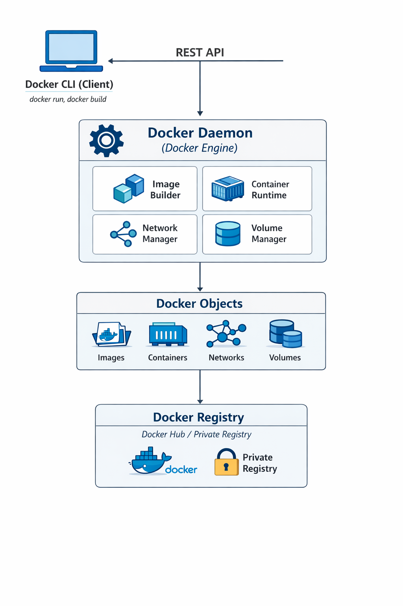

# 🐳 Docker Learning Repository

###  This repository is designed to make Docker easy to learn by providing clear explanations, hands-on examples, and practical container implementations. It covers Docker fundamentals, container lifecycle, Dockerfiles, images, volumes, networks, and real-world containerized applications.
---
Here, we will cover the below concepts to become a pro in docker.
- What is a Container?
- Container V/s Image
- Docker V/s Virtual Machine
- Main Docker Commands
- Develop With Containers
- Run Multiple Containers using Docker compose
- Build own Docker imaage using Docker file
- Push to private Docker Repository
- Deploy Containerized application
- Persistent data in Docker
# Docker With Nexus
- Deploy and setup Nexus as Docker Container
- Create private docker repository on Nexus
- Push / Fetch Docker Repository
---

## What is a Container?
A **container** is a lightweight, standalone, and executable package that includes:
- Application code
- Runtime
- System libraries
- Dependencies

Containers run consistently across environments such as **development, testing, and production**.  
It is made up of layers of images.  
It has mostly linux base image, because it's small in size.  
Application image on top.  
> Postgres:10.10  --> Layer- application Image
>
> alphine-30 --> Layer - Linux base Image

## What is Image?
It is a way to package application with all the necessary dependencies and configuration.  
It is portable artifact, easily shared and moved.  
It makes development and deployment more efficient.  

### Interview Key Point:
> Containers eliminate the “it works on my machine” problem by packaging everything together.

---

## 📦 Container vs Image

| Image | Container |
|------|----------|
| Blueprint / template | Running instance of an image |
| Read-only | Read-write |
| Created once | Can be started, stopped, deleted |

### Example:
- **Docker Image** → NGINX image
- **Docker Container** → Running NGINX server

### Interview Tip:
> An image is static, a container is dynamic.

---

## 🆚 Docker vs Virtual Machine

| Docker | Virtual Machine |
|------|----------------|
| Lightweight | Heavy |
| Shares host OS kernel | Separate OS per VM |
| Faster startup | Slow startup |
| Less resource usage | High resource usage |
| Virtualize Applications | Virtualize application and OS Kernel |

### Interview Key Point:
> Docker containers are faster and more efficient than virtual machines because they don’t require a full OS.

---
## Docker Architecture




## 🐳 Docker Engine

The **Docker Engine** is the core component of Docker that enables building, running, and managing containers.  
It follows a **client–server architecture** and consists of three main parts:

- Docker Server (Docker Daemon)
- Docker REST API
- Docker CLI

---

### 🔹 Docker Server (Docker Daemon)

The **Docker Server**, also known as the **Docker Daemon (`dockerd`)**, performs all the core Docker operations.

### Responsibilities:
- Pulls Docker images from registries
- Builds Docker images
- Creates and manages containers
- Manages Docker networks and volumes

---

### 🔸 Components Inside Docker Server

- Container Runtime
- Volumes
- Network
- Image Builder

#### 🧩 Container Runtime
- Responsible for running containers
- Manages the **container lifecycle** (create, start, stop, delete)
- Uses container runtime such as `containerd`

**Interview Point:**  
> The container runtime is responsible for executing containers.

---

#### 💾 Volumes
- Used to **persist data** generated by containers
- Data remains available even if the container is removed
- Recommended for production workloads

**Interview Point:**  
> Volumes solve the problem of container data loss.

---

#### 🌐 Networks
- Enables communication between containers
- Provides isolation and security
- Supports multiple network types (bridge, host, overlay)

**Interview Point:**  
> Docker networking enables secure container-to-container communication.

---

#### 🏗️ Image Builder
- Builds Docker images using Dockerfiles
- Converts application code into a reusable Docker image

**Interview Point:**  
> Docker images are built using Dockerfile instructions.

---

### 🔹 Docker REST API

The **Docker API** allows communication between the Docker Client and Docker Server.

- Uses RESTful APIs
- Can be accessed locally or remotely
- Enables automation and integration with CI/CD tools

**Interview Point:**  
> Docker CLI communicates with Docker Daemon via Docker REST API.

---

### 🔹 Docker CLI (Command Line Interface)

The **Docker CLI** is the user-facing tool used to interact with Docker.

- Executes commands like `docker run`, `docker build`, `docker pull`
- Sends requests to Docker Daemon through Docker API
- Does not directly run containers

**Interview Point:**  
> Docker CLI is just a client; all execution happens on Docker Daemon.

---

## 🧠 Summary

- Docker Engine is the core of Docker
- Docker Daemon does the actual work
- Docker API enables communication
- Docker CLI provides user interaction
- Runtime, volumes, networks, and image builder are managed by Docker Server

---

## 🎯 Interview One-Line Answer

**What is Docker Engine?**  
> Docker Engine is a client–server application responsible for building, running, and managing Docker containers.

---

## 🛠️ Main Docker Commands

| Command | Purpose |
|------|--------|
| `docker version` | Check Docker installation |
| `docker pull` | Download image |
| `docker run` | Create & run container |
| `docker ps` | List running containers |
| `docker ps -a` | List all containers |
| `docker images` | List images |
| `docker stop` | Stop container |
| `docker rm` | Remove container |
| `docker rmi` | Remove image |
| `docker start` | Start container |
| `docker exec -it` | login to container |
| `docker logs` | To see logs of container |

### Interview Tip:
> `docker run` = pull + create + start

---

## Container Port V/S Host Port

Multiple containers can run on your host machine.  
Your laptop has certain ports available  
Maybe a change to get conflicts when we use same port on host machine. So Port Binding comes into the play..  

Host Port : 5000, Application running on container with port: 3000

docker run -p 5000:3000 redis , then you can access the website using hostip:hostport.


## 🧑‍💻 Develop With Containers

Docker allows developers to:
- Use the same environment everywhere
- Avoid dependency conflicts
- Improve collaboration

### Example Use Case:
- Developer runs application in Docker
- QA and Production use the **same image**

### Interview Key Point:
> Docker ensures environment consistency across the SDLC.

---

## 🔁 Run Multiple Containers using Docker Compose

**Docker Compose** is used to run **multiple containers** using a single YAML file.

### Example Use Case:
- Web application + Database
- Frontend + Backend + Cache

### Benefits:
- One command to start all services
- Easy configuration management

```bash
docker-compose up
```

---

## 💾 Docker Volumes

### 📌 What is a Docker Volume?

A **Docker Volume** is a **persistent storage mechanism** used to store data generated by containers.  
Volumes exist **outside the container lifecycle**, which means data is **not lost when a container stops or is removed**.

### Why Do We Need Volumes?

By default, containers are **ephemeral**:
- Data is lost when the container is deleted
- Not suitable for databases or logs

**Volumes solve this problem** by providing persistent storage.

---

### 🔹 Types of Docker Storage

| Type | Description |
|----|------------|
| Volumes | Managed by Docker (recommended) |
| Bind Mounts | Maps host directory |
| tmpfs | Stored in memory |

### Interview Tip:
> Docker Volumes are preferred over bind mounts in production.

---

### 🔹 Docker Volume Commands

| Command | Purpose |
|------|--------|
| `docker volume create vol1` | Create volume |
| `docker volume ls` | List volumes |
| `docker volume inspect vol1` | View details |
| `docker volume rm vol1` | Remove volume |

---

### 🔹 Using Volume with Container

```bash
docker run -d \
  -v myvolume:/data \
  nginx
```

### 3 ways to bind host file system to docker virtual file system.

1. To mount a specific path or folder in host server to container virtual file system.
   ```bash
   docker run -v /home/mount/data:/var/lib/mysql/data
   ```

2. For each container a folder is generated automatically that gets mounted to our docker container virtual file system.
   ```bash
   docker run -v /var/lib/mysql/data

   ## default path of automatically generated by docker is /var/lib/docker/volumes/random-hash/_data
   ```
3. Referencing a volume by name and should be used in production.
   ```bash
   docker run -v name:/var/lib/mysql/data
   ```
---

# 🌐 Docker Networks

Docker Networks enable **communication between containers**, **data flow between services**, and **secure connectivity** to external systems.  
They play a crucial role in **microservices architecture, scalability, and security**.

---

## 📌 What is a Docker Network?

A Docker Network allows containers to communicate with each other and with external systems securely.
It provides network isolation, service discovery, and controlled communication between containers.

A **Docker Network** is a virtual network layer that allows containers to:
- Exchange data with other containers
- Communicate with the host system
- Access external networks (internet, APIs, databases)

Docker networking abstracts low-level networking concepts such as:
- IP addressing
- Routing
- DNS resolution
- Port mapping

---

## 🔄 How Docker Network Works (Internals)

When a container is attached to a network:
- Docker assigns an **IP address**
- Adds **DNS entry** for container name
- Creates **virtual Ethernet interfaces**
- Handles routing and NAT automatically

---

## 🔹 Default vs Custom Docker Network

### Default Bridge Network
- Containers communicate using IP only
- No automatic DNS resolution
- Not recommended for production

### Custom Bridge Network
- Automatic container name resolution
- Better isolation
- More secure and flexible

### Interview Tip:
> Always use **custom bridge networks** for multi-container applications.

---

## 🔹 Types of Docker Networks (With Use Cases)

| Network Type | Description | Use Case |
|-------------|------------|---------|
| bridge | Isolated network for containers | Local microservices |
| host | Uses host network stack | High-performance apps |
| none | No networking | Security testing |
| overlay | Multi-host networking | Docker Swarm / Kubernetes |
| macvlan | Physical network exposure | Legacy apps |

---

## 🔹 Docker Network Commands (With Purpose)

| Command | Purpose |
|------|---------|
| `docker network create app-net` | Create isolated network |
| `docker network ls` | List all networks |
| `docker network inspect app-net` | View IP, containers, routes |
| `docker network connect` | Attach container to network |
| `docker network disconnect` | Detach container |

---

## 🔹 Container-to-Container Communication

Containers in the same network:
- Communicate using **container name**
- No need for hardcoded IPs
- Docker DNS resolves names automatically

### Example

```bash
docker network create backend-net

docker run -d --name api --network backend-net my-api
docker run -d --name db --network backend-net mysql

